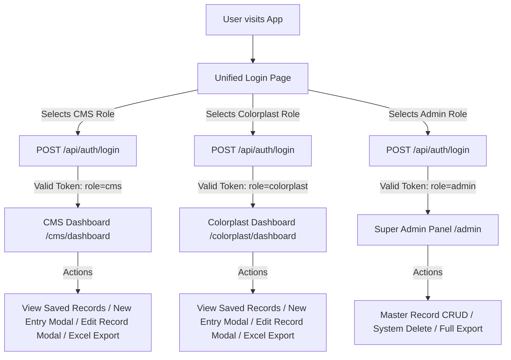

# CMS & Colorplast Dual Dashboard System Guide

A comprehensive architectural, technical, and operational manual detailing the role-based authentication, dual dashboards, CRUD workflows, database integration, and UI features implemented in the Customer Onboarding application.

---

## Table of Contents
1. [Overview & Objectives](#1-overview--objectives)
2. [Role-Based Access Architecture](#2-role-based-access-architecture)
3. [Database Schema & Migration](#3-database-schema--migration)
4. [Backend API Endpoints Reference](#4-backend-api-endpoints-reference)
5. [Frontend Architecture & Dashboards](#5-frontend-architecture--dashboards)
   - [5.1 Unified Login Page](#51-unified-login-page)
   - [5.2 CMS Operations Dashboard](#52-cms-operations-dashboard)
   - [5.3 Colorplast Operations Dashboard](#53-colorplast-operations-dashboard)
   - [5.4 Shared Entry & Edit Modal (`EntryModal`)](#54-shared-entry--edit-modal-entrymodal)
   - [5.5 Super Admin Control Panel](#55-super-admin-control-panel)
6. [Step-by-Step User Workflows](#6-step-by-step-user-workflows)
   - [Workflow A: Logging In](#workflow-a-logging-in)
   - [Workflow B: Adding a New Entry](#workflow-b-adding-a-new-entry)
   - [Workflow C: Editing an Existing Record](#workflow-c-editing-an-existing-record)
   - [Workflow D: Filtering, Searching & Excel Export](#workflow-d-filtering-searching--excel-export)
7. [Running and Testing Locally](#7-running-and-testing-locally)

---

## 1. Overview & Objectives

This project separates customer onboarding and order tracking into two dedicated, brand-aligned dashboards:
- **CMS Dashboard** (`/cms/dashboard`): Dedicated to CMS clients and partner operations with a teal/cyan themed interface.
- **Colorplast Dashboard** (`/colorplast/dashboard`): Dedicated to Colorplast internal operations with signature corporate blue styling.
- **Super Admin Dashboard** (`/admin`): Complete system oversight, master record viewing, editing, and deletion across all roles.

### Key Capabilities:
- **Role-Based Authentication**: Secure role validation via JWT tokens.
- **Unified Login Screen**: Intuitive role cards (`CMS Portal`, `Colorplast`, `Admin`) and 1-click test login buttons.
- **Real-Time Data Table**: Displays all saved onboarding details with live search and status indicators.
- **"➕ New Entry" Modal**: Clean modal form with automated ATR/ATS chip parameter resolution.
- **"✏️ Edit" Modal**: Instant inline modal pre-filled with existing data to modify any order fields and persist changes to SQL Server.
- **Excel Reporting**: Role-specific and master export capabilities (`.xlsx`).

---

## 2. Role-Based Access Architecture



### Pre-Configured Test Credentials:
| Portal Role | Role ID | Default Username | Default Password | Target Route |
| :--- | :--- | :--- | :--- | :--- |
| **CMS Portal** | `cms` | `cms` | `cms@123` | `/cms/dashboard` |
| **Colorplast** | `colorplast` | `colorplast` | `color@123` | `/colorplast/dashboard` |
| **Super Admin** | `admin` | `admin` | `admin@123` | `/admin` |

---

## 3. Database Schema & Migration

The system connects to **Microsoft SQL Server (LocalDB)** instance `(localdb)\mssqllocaldb` database `Processing_Dashboard`.

### Table: `POSubmissions`
| Column Name | Data Type | Description |
| :--- | :--- | :--- |
| `id` | `INT IDENTITY(1,1) PRIMARY KEY` | Auto-increment primary key |
| `role_id` | `NVARCHAR(50)` | Creator role ID (`cms`, `colorplast`, `admin`, `general`) |
| `sr_no` | `NVARCHAR(50)` | Serial Number |
| `po_no` | `NVARCHAR(100)` | Purchase Order Number (*Required*) |
| `product_description` | `NVARCHAR(500)` | Product details and description (*Required*) |
| `po_date` | `NVARCHAR(50)` | Purchase Order Date (*Required*) |
| `card_quantity` | `NVARCHAR(100)` | Total card quantity (*Required*) |
| `antenna_type` | `NVARCHAR(100)` | Antenna type (`Any`, `Half`, `Full`) |
| `perso_type` | `NVARCHAR(100)` | Personalization method (`Flat`, `Embossing`) |
| `module_make` | `NVARCHAR(200)` | Module manufacturer model (e.g. `NXP JCOP4 B75B`) |
| `module_part_code` | `NVARCHAR(200)` | Manufacturer part code |
| `chip_atr` | `NVARCHAR(200)` | Answer To Reset (ATR) hex string |
| `chip_ats` | `NVARCHAR(200)` | Answer To Select (ATS) hex string |
| `module_qty_sent` | `NVARCHAR(100)` | Quantity of modules dispatched |
| `module_sent_date` | `NVARCHAR(50)` | Date modules were dispatched |
| `module_received_date`| `NVARCHAR(50)` | Date modules were received |
| `cdd` | `NVARCHAR(50)` | Committed Delivery Date |
| `order_status` | `NVARCHAR(100)` | Status (`In Process`, `Hold`, `Dispatched`) |
| `submitted_at` | `DATETIME DEFAULT GETDATE()` | Timestamp when record was created |
| `updated_at` | `DATETIME NULL` | Timestamp when record was last updated |

---

## 4. Backend API Endpoints Reference

### Authentication
- **`POST /api/auth/login`**
  - **Payload**: `{ "username": "cms", "password": "cms@123", "role": "cms" }`
  - **Response**: `{ "token": "...", "role": "cms", "username": "cms", "roleName": "CMS Portal" }`

### Data & Records
- **`GET /api/records`**
  - **Query**: `?role=cms` or `?role=colorplast` (or none for all)
  - **Response**: Array of submission objects ordered by `submitted_at DESC`.
- **`GET /api/records/:id`**
  - **Response**: Single record object matching the specified ID.
- **`POST /api/submit`**
  - **Payload**: Full order JSON object including `role_id`.
  - **Response**: `{ "success": true, "id": 4, "message": "..." }`
- **`PUT /api/records/:id`**
  - **Payload**: Updated field values.
  - **Response**: `{ "success": true, "message": "Record updated successfully!" }`
- **`DELETE /api/records/:id`**
  - **Response**: `{ "success": true, "message": "Record deleted successfully" }`

### Utilities & Reports
- **`GET /api/schema`**: Returns metadata, types, and options for all onboarding fields.
- **`GET /api/module-atr-ats`**: Returns automated lookup table mapping Module Make to ATR and ATS hex strings.
- **`GET /api/export`**: Returns generated `.xlsx` spreadsheet formatted with styled column widths and role filtering.

---

## 5. Frontend Architecture & Dashboards

### 5.1 Unified Login Page (`LoginPage.jsx`)
- Role card selector with visual highlights for **CMS**, **Colorplast**, and **Admin**.
- Quick 1-click test buttons (`💼 CMS (cms)`, `🏢 Colorplast (colorplast)`, `🔐 Admin (admin)`).
- Automatically saves token and role metadata to browser storage and redirects to the designated dashboard.

### 5.2 CMS Operations Dashboard (`CmsDashboard.jsx`)
- Dedicated teal/cyan portal theme.
- Top KPI summary cards for instant status tracking.
- **"➕ New Entry"** button launching the interactive entry modal.
- Search filter with instant matching across all column fields.
- Table listing with **"✏️ Edit"** button on each row.
- Role-specific Excel exporter.

### 5.3 Colorplast Operations Dashboard (`ColorplastDashboard.jsx`)
- Colorplast signature corporate blue theme and official brand icon.
- Full real-time synchronization with Microsoft SQL Server.
- Seamless creation and updating of records via `EntryModal`.

### 5.4 Shared Entry & Edit Modal (`EntryModal.jsx`)
- Modal overlay preventing accidental page clicks and keeping table scroll position.
- Keyboard navigation: Pressing **Enter** advances cursor focus to the next field.
- **Smart Auto-Fill**: Selecting **Module Make** (e.g. `NXP JCOP4 B75B`) immediately auto-fills `chip_atr` and `chip_ats`.
- Automatic detection of `isEdit` state: Switches between `POST /api/submit` and `PUT /api/records/:id`.

---

## 6. Step-by-Step User Workflows

### Workflow A: Logging In
1. Open `http://localhost:5173/` in your browser.
2. Select your desired role tab (**CMS Portal** or **Colorplast**).
3. Click the corresponding **Quick Test Account** button or enter credentials.
4. Click **Sign In** to navigate directly to your dashboard.

### Workflow B: Adding a New Entry
1. Inside your dashboard, click **"➕ New Entry"** in the toolbar.
2. Fill in the required fields:
   - **PO No.** (e.g. `PO-2026-001`)
   - **Product Description** (e.g. `Dual Interface Banking Smartcard`)
   - **PO Date** and **Card Quantity**
3. Under *Technical Specifications*, select a **Module Make**; watch `Chip ATR` and `Chip ATS` auto-populate instantly.
4. Select the current **Order Status** (`In Process`, `Hold`, or `Dispatched`).
5. Click **💾 Save Entry**. The modal closes, a toast appears, and the new record appears at the top of the table.

### Workflow C: Editing an Existing Record
1. Locate any record in the dashboard table.
2. Click the **"✏️ Edit"** button in the Actions column.
3. The modal opens pre-filled with all existing values.
4. Modify any field (for example, change **Order Status** to `Dispatched` or update **Module Sent Date**).
5. Click **💾 Update Record**. The record updates in the database and updates on your screen in real time.

### Workflow D: Filtering, Searching & Excel Export
1. Type any keyword (such as `NXP`, a PO number, or `Dispatched`) into the search bar to filter rows instantly.
2. Click **📥 Export Excel** to download the customized `.xlsx` report.

---

## 7. Running and Testing Locally

### Start Both Servers Concurrently:
Run the startup batch script in the root directory:
```bat
start_all.bat
```

### Or Start Individually:
1. **Backend Server**:
   ```bash
   cd backend
   npm start
   ```
   *Runs at `http://localhost:5000`*

2. **Frontend Development Server**:
   ```bash
   cd frontend
   npm run dev
   ```
   *Runs at `http://localhost:5173`*
